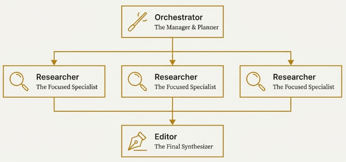
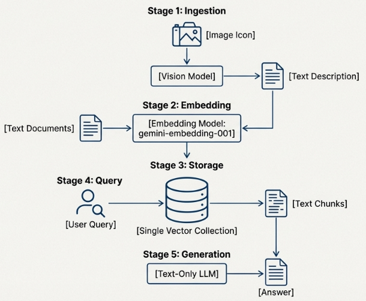

# Financial Deep Research Agent

Multi-agent system that combines a knowledge base of SEC filings (10-K, 10-Q) with real-time market data to perform comprehensive financial research. An orchestrator manages specialized researcher agents that query historical data from Qdrant and live data from a Yahoo Finance MCP server, while an editor agent reviews the researchers' findings and delivers a well-structured, cited response to the user.

Built from scratch with LangGraph, Langchain, Qdrant, Docling and MCP.



## MCP Server

The Yahoo Finance MCP server runs on a Raspberry Pi 4 with Docker, connected via HTTP + SSE transport using FastMCP. This keeps live market data decoupled from the main agent and allows the server to run independently.

## RAG Pipeline

The RAG pipeline transforms raw SEC filing PDFs into searchable vectors through three stages: extraction, description and ingestion.
**1. Document Extraction (Docling)**
From a bank of SEC filing PDFs, Docling extracts three types of content:

- Text
- Table
- Images

PDFs are processed in batches of 5–10 pages to prevent memory exhaustion on machines with limited RAM.
**2. Chart Description (Gemini 2.5 Flash)**
Financial charts are passed to Gemini 2.5 to generate a description of each chart.

**3. Ingestion into Qdrant**
All Markdown content (text, tables, chart descriptions) is embedded and stored in Qdrant with hybrid retrieval:

- Dense embeddings: gemini-embedding-001
- Sparse embeddings: Qdrant/BM25
- Retrieval mode: Hybrid (dense + sparse in parallel & results fused)

Each file is hashed with SHA-256 before ingestion. If the hash already exists in the collection, the file is skipped. This makes the pipeline idempotent — you can re-run it safely without duplicating data.


### Setup

**Installation**

```python
git clone https://github.com/JeffersonG96/financial_deep_research_agent.git
cd financial_deep_research_agent
uv install
```

Run the data pipeline

```python
# 1. Extract content from PDFs
uv run python -m scripts.pdf_extractor

# 2. Generate chart descriptions
uv run python -m scripts.images_description

# 3. Ingest into Qdrant
uv run python -m scripts.md_ingest
```
